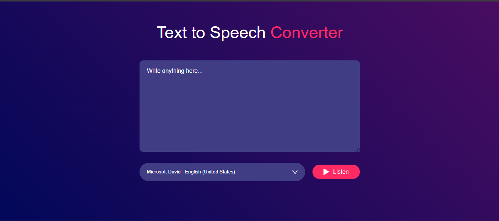
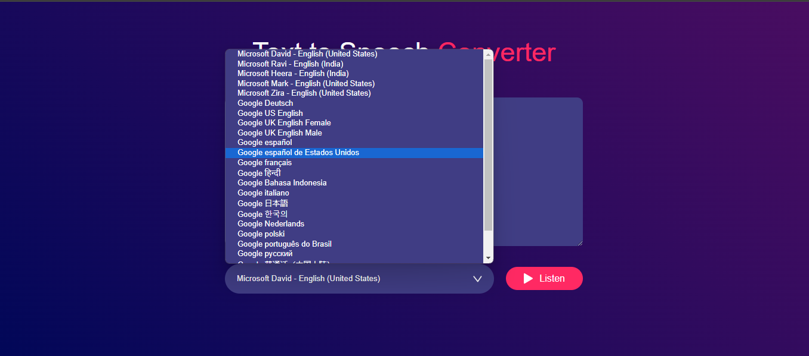

# Text-to-Voice Converter

This is a simple Text-to-Voice Converter web application built using HTML, CSS, and JavaScript. The application allows users to input text, which is then converted to speech using the browser's built-in speech synthesis feature.

## Features

- **Text Input**: Users can input any text they want to be converted to speech.
- **Voice Options**: Users can choose from different voices and adjust the speech rate and pitch.
- **Play and Pause**: Users can play, pause, and stop the speech at any time.

## Technologies Used

- **HTML**: For structuring the web application.
- **CSS**: For styling the application and making it visually appealing.
- **JavaScript**: For handling the text-to-speech conversion and interactivity.

## How It Works

1. Users input their desired text into the provided text area.
2. Users can select a voice, adjust the rate and pitch of the speech.
3. Upon clicking the "Speak" button, the text is converted to speech using the Web Speech API.
4. The speech can be paused, resumed, or stopped at any time using the respective controls.

## Screenshots

### Home Page

### Voice Options

### Speech in Action

> **Note:** Replace the image paths above with the correct paths to your screenshots in the repository.

## Website Demo

Check out the live demo of the Text-to-Voice Converter here: [Text-to-Voice Converter Demo](https://vallabh1807.github.io/Text-to-Speech-Convertor/)

